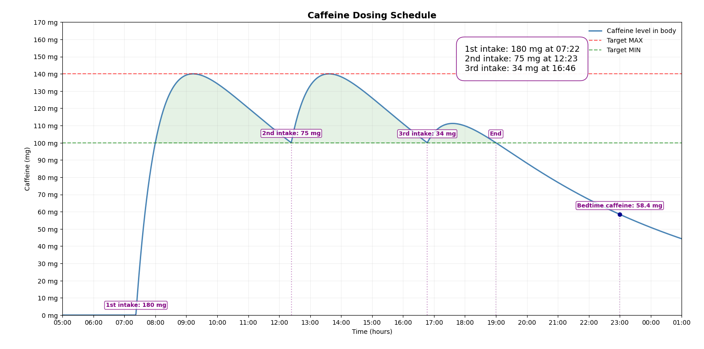

# Caffeine Dosing Scheduler

A tool to plan your caffeine intake so you stay alert without jitters or crashes. Enter your desired caffeine range and active hours, and the scheduler calculates a scientifically grounded dosing schedule.

---

## What This Tool Does

Imagine this: you sit down to work or study at 09:00, you want to stay alert until 18:00, and you want your caffeine level to remain in that magical zone where your brain feels sharp but not jittery. You pick a comfortable range—for example, 100 to 140 mg—and the scheduler handles everything else.

The script figures out:

* **When** your first intake should happen (often around 30–60 minutes before your start time).
* **How large** that dose should be so you arrive at your minimum target level right at your start time.
* **Middle doses** spaced across the day to keep you inside your target zone.
* **Final dose** calculated so by 18:00 you return exactly to your chosen minimum.

---

## Why It’s Useful

Caffeine’s effects are largely predictable once you model its absorption and elimination. Working with that predictability gives you a few big wins:

* Helps prevent overstimulation and anxiety by avoiding uncontrolled peaks.
* Protects your sleep by avoiding unwanted caffeine leftovers near bedtime.
* Stabilizes mental performance instead of pushing you into spike → crash cycles.

**In short: more focus, less chaos.**

---

## Features & Example Run

The scheduler provides a simple command-line workflow:

- Enter your **peak** (`Cmax_target`) and **trough** (`Cmin_target`) caffeine levels  
- Specify your **active window** (`t_start` → `t_end`)  
- Set your **bedtime** for plotting  

Behind the scenes, it handles:

- First-dose sizing and timing  
- Repeating-dose calculation to maintain the target range  
- Final-dose correction to end at `Cmin_target`  
- Full simulation of the caffeine curve using the PK model  

**Example Input:**

1. Peak caffeine: 140 mg  
2. Minimum caffeine: 100 mg  
3. Start time: 8.0 h (08:00)  
4. End time: 19.0 h (19:00)  
5. Sleep time: 23.0 h (23:00)  

**Output:**

- Complete dose regimen with exact times and amounts  
- Full caffeine concentration plot for the day  
- Estimated caffeine at bedtime  



---

## The Caffeine Model

The scheduler is built on a standard PK model with:

* **Absorption half-life:** 0.5 h
* **Elimination half-life:** 5 h

From those, it computes:

```text
k_a = ln(2)/0.5
k   = ln(2)/5.0
```

A single dose produces a concentration curve:

```text
C_D(t) = D * (k_a/(k_a - k)) * (exp(-k*t) - exp(-k_a*t))
```

Peak occurs at:

```text
T_max = ln(k_a/k) / (k_a - k)
```

The peak multiplier is:

```text
pm = (k_a/(k_a - k)) * (exp(-k*T_max) - exp(-k_a*T_max))
```

So the first dose is:

```text
D_first = Cmax_target / pm
```

Subsequent doses are solved numerically to keep the trough above `Cmin_target`.

---

## How the Algorithm Works

* Computes the required initial dose to hit your target peak.
* Rewinds that dose so you begin your window already inside the target range.
* Finds a repeating interval and dose that hold the trough steady.
* Adjusts the final dose so you end at your target trough exactly at `t_end`.
* Simulates the full curve, including bedtime residual caffeine.

---


